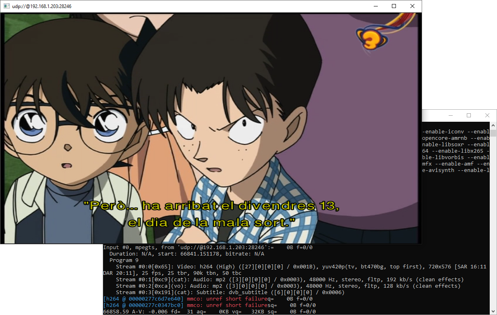

# MovistarU7D

Reproductor y grabador para el servicio U7D de Movistar+

**Requiere Python 3.6 (o superior) y [ffmpeg](https://ffmpeg.zeranoe.com/builds/).**



### Parámetros

```
usage: Stream content from the Movistar U7D service. [-h] [--quality {sd,hd}]
                                                     [--start seconds]
                                                     [--write file]
                                                     broadcast channel

positional arguments:
  broadcast             broadcast id
  channel               channel id

optional arguments:
  -h, --help            show this help message and exit
  --quality {sd,hd}, -q {sd,hd}
                        stream quality
  --start seconds, -s seconds
                        stream start offset
  --write file, -w file
                        write stream to file
```

Para encontrar los identificadores del programa y canal, debemos haber descargado la EPG con un script como [este](https://github.com/MovistarTV/tv_grab_es_movistartv). Los valores los podemos encontrar en la sección `original-title`.

### Ejemplos

Ver un programa:
```bash
$ u7d.py 1570300879 2531
```

Ver un programa en definición estándar:
```bash
$ u7d.py 1570300879 2531 -q sd
```

Grabar un programa:
```bash
$ u7d.py 1570300879 2531 -w Movie.ts
```

Grabar un programa a partir de los primeros cinco minutos:
```bash
$ u7d.py 1570300879 2531 -w Movie.ts -s 300
```
